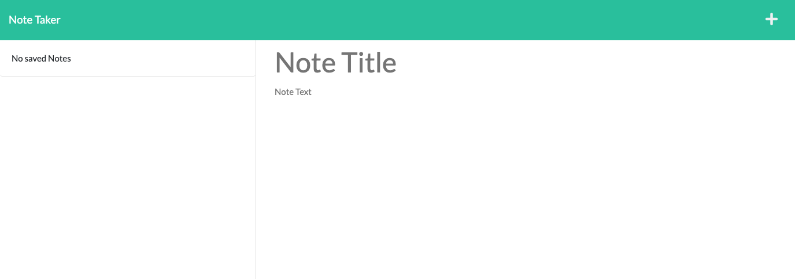

# Note Taker

## Description
This is a simple note taking application. The user is able to write a title and text description for the note and save it. 

To view the deployed application, [click here](https://kaylab78.github.io/note-taker/). To view the application on Heroku [click here](https://note-taker-202207.herokuapp.com/).

## Table of Contents
- [Installation](#installation)
- [Usage](#usage)
- [Technologies](#technologies)
- [License](#license)
- [Credits](#credits)

## Installation
In order to install this project, the user must have Node.js installed on their local machine. 

The user can clone the repository from [GitHub](https://github.com/kaylab78/team-profile-generator) in their CLI. 

The user must install Express.js. First, use <samp>npm init -y</samp> to initialize the npm package. Then, type <samp>npm i express</samp> to install Express.js.

Once the user is ready to test the application on their local machine, type <samp>npm start</samp> in the CLI and type http://localhost:3001 in the browser to view the application on the local server.

## Usage
The user is first presented with the app's homepage.
 

When the user clicks on the "Get Started" button, they are taken to a page where they can create and save their own notes.

In order to create a new note, the user types a title and a description in the appropriate boxes. The user clicks the save icon in the upper right corner to save the note. 

## Technologies
- [Express.js](https://www.npmjs.com/package/express)
- [Node.js](https://nodejs.org/en/)

## License
&copy; 2022 by Kayla Backus

This project is licensed under the MIT license.

[License: MIT License](https://opensource.org/licenses/MIT)

## Credits
Starter code cloned from [https://github.com/coding-boot-camp/miniature-eureka](https://github.com/coding-boot-camp/miniature-eureka).